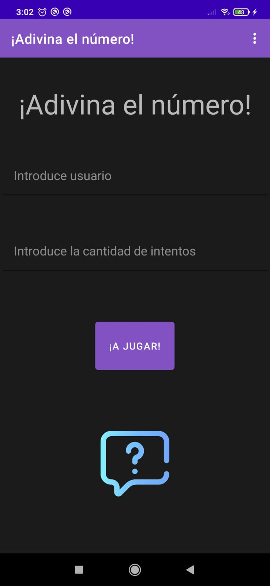
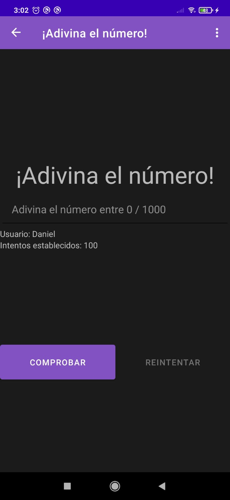
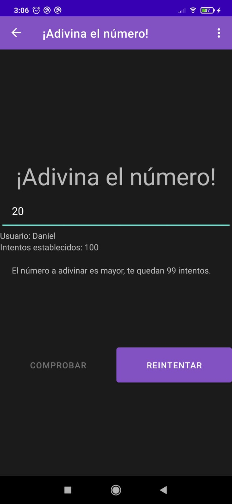
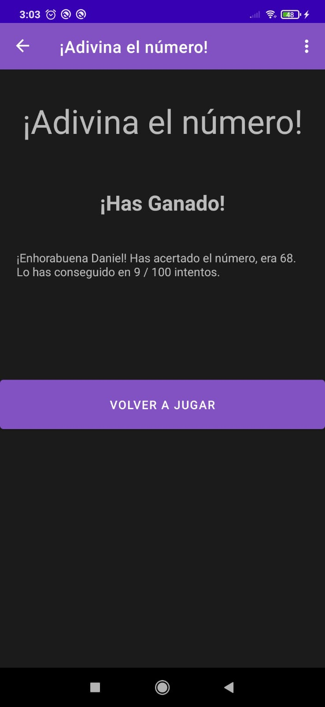
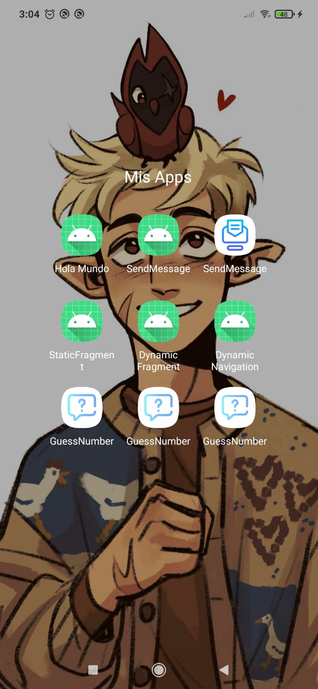
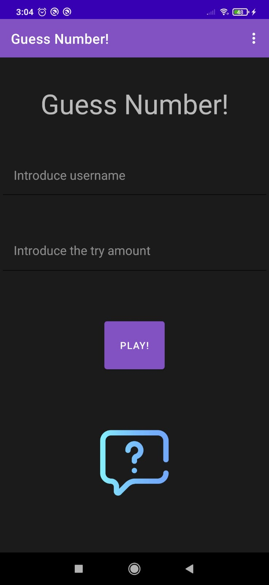
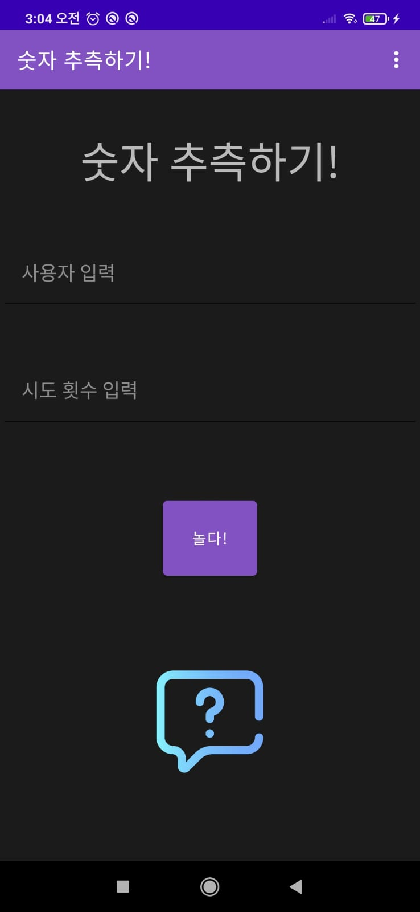

# Projecto 03 - Guess Number - Version Navigation

## Información del proyecto

Este proyecto es un pequeño juego de adivinanza, en este tienes que descubrir el número aleatorio que se ha generado de forma automática en la cantidad de intentos que tu mismo dictes.
Al ser el mismo proyecto que el GuessNumber anterior solo que se cambia la forma de hacerlo (Esta vez usando los fragments y el navigation). El readme va a ser prácticamente igual quitando los cambios
que trae de por el navigation.

## Característica del proyecto

Durante la realización de este proyecto hemos:
* Cambiado las activities por fragments
* Conectado los fragments a través del navigation
* Se ha usado el Toast para avisar de cuando era necesario la introducción de datos
* Se ha añadido icono de la app responsive
* Se ha añadido un recurso Drawable
* Se ha añadido los ciclos de vida de los fragments y de la activity
* Traducida la aplicación a inglés y coreano (Español por defecto)

## Novedades en el proyecto

Las novedades añadidas el projecto fuera de lo pedidos son:
* Traducido a un tercer idioma (Coreano)
* Icono personalizado
* Recurso Drawable
* Diseño más desarrollado

## Imágenes
> Programa instalado en nuestro dispositivo movil

> Config Activity (En español)

> Play Activity (En español)

> EndPlay Acitivity

> Versión Inglesa

> Versión Coreana

## Comentario personal sobre el proyecto

La coversión de fragment dinamico a navigation ha sido realmente sencilla. Tediosa, porque requiere su tiempo y no olvidarte muchisimas cosas pequeñas
pero sencillo. Una vez pasado todo solo quedaba cambiar las transactions por el navhost y ya. Cambiar la forma de guardar los datos usando el FragmentXArgs y poco más.

Todo el resto es exactamente igual. La aplicación funciona exactamente igual, y de la misma manera que con el dinamic fragment la pantalla está capada
en vertical. 
